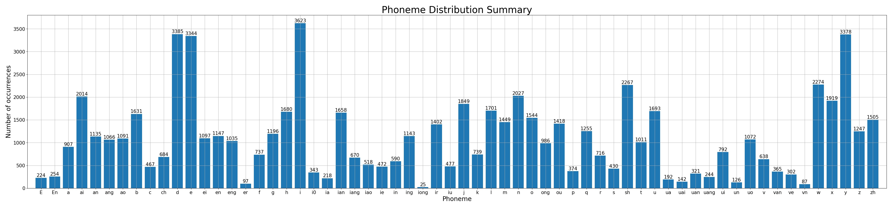

# Best Practices

## Materials for training and using models

### Datasets

A dataset mainly includes recordings and transcriptions, which is called a _raw dataset_. Raw datasets should be organized as the following folder structure:

- my_raw_data/
  - wavs/
    - 001.wav
    - 002.wav
    - ... (more recording files)
  - transcriptions.csv

In the example above, the _my_raw_data_ folder is the root directory of a raw dataset.

The _transcriptions.csv_ file contains all labels of the recordings. The common column of the CSV file is `name`, which represents all recording items by their filenames **without extension**. Elements of sequence attributes should be split by `space`. Other required columns may vary according to the category of the model you are training, and will be introduced in the following sections.

### Dictionaries

A dictionary is a .txt file, in which each line represents a mapping rule from one syllable to its phoneme sequence. The syllable and the phonemes are split by `tab`, and the phonemes are split by `space`:

```
<syllable>	<phoneme1> <phoneme2> ...
```

Syllable names and phoneme names can be customized, but with the following limitations/suggestions:

- `SP` (rest), `AP` (breath) and `<PAD>` (padding) cannot be used because they are reserved.
- `-` and `+` cannot be used because they are defined as slur tags in most singing voice synthesis editors.
- Special characters including but not limited to `@`, `#`, `&`, `|`, `/`, `<`, `>`, etc. should be avoided because they may be used as special tags in the future format changes. Using them now is okay, and all modifications will be notified in advance.
- ASCII characters are preferred for the best encoding compatibility, but all UTF-8 characters are acceptable.

There are some preset dictionaries in the [dictionaries/](../dictionaries) folder. For the guidance of using a custom dictionary, see [Using custom dictionaries](#using-custom-dictionaries).

### Configuration files

A configuration file is a YAML file that defines enabled features, model hyperparameters and controls the behavior of the binarizer, trainer and inference. For more information of the configuration system and configurable attributes, see [Configuration Schemas](ConfigurationSchemas.md).

### DS files

DS files are JSON files with _.ds_ suffix that contains phoneme sequence, phoneme durations, music scores or curve parameters. They are mainly used to run inference on models for test and evaluation purposes, and they can be used as training data in some cases. There are some example DS files in the [samples/](../samples) folder.

The current recommended way of using a model for production purposes is to use [OpenUTAU for DiffSinger](https://github.com/xunmengshe/OpenUtau). It can export DS files as well.

### Other fundamental assets

#### Vocoders

A vocoder is a model that can reconstruct the audio waveform given the low-dimensional mel-spectrogram. The vocoder is the essential dependency if you want to train an acoustic model and hear the voice on the TensorBoard.

The [DiffSinger Community Vocoders Project](https://openvpi.github.io/vocoders) provides a universal pre-trained NSF-HiFiGAN vocoder that can be used for starters of this repository. To use it, download the model (~50 MB size) from its releases and unzip it into the `checkpoints/` folder.

The pre-trained vocoder can be fine-tuned on your target dataset. It is highly recommended to do so because fine-tuned vocoder can generate much better results on specific (seen) datasets while does not need much computing resources. See the [vocoder training and fine-tuning repository](https://github.com/openvpi/SingingVocoders) for detailed instructions. After you get the fine-tuned vocoder checkpoint, you can configure it by `vocoder_ckpt` key in your configuration file. The fine-tuned NSF-HiFiGAN vocoder checkpoints can be exported to ONNX format like other DiffSinger user models for further production purposes.

Another unrecommended option: train a ultra-lightweight [DDSP vocoder](https://github.com/yxlllc/pc-ddsp) first by yourself, then configure it according to the relevant [instructions](https://github.com/yxlllc/pc-ddsp/blob/master/DiffSinger.md).

#### Pitch extractors

RMVPE is the recommended pitch extractor of this repository, which is an NN-based algorithm and requires a pre-trained model. For more information about pitch extractors and how to configure them, see [pitch extraction](#pitch-extraction).

## Overview: training acoustic models

An acoustic model takes low-level singing information as input, including (but not limited to) phoneme sequence, phoneme durations and F0 sequence. The only output of an acoustic model is the mel-spectrogram, which can be converted to waveform (the final audio) through the vocoder. Briefly speaking, an acoustic model takes in all features that are explicitly given, and produces the singing voice.

### Datasets

To train an acoustic model, you must have three columns in your transcriptions.csv: `name`, `ph_seq` and `ph_dur`, where `ph_seq` is the phoneme sequence and `ph_dur` is the phoneme duration sequence in seconds. You must have all corresponding recordings declared by the `name` column in mono, WAV format.

Training from multiple datasets in one model (so that the model is a multi-speaker model) is supported. See `speakers`, `spk_ids` and `use_spk_id` in the configuration schemas.

### Functionalities

Functionalities of acoustic models are defined by their inputs. Acoustic models have three basic and fixed inputs: phoneme sequence, phoneme duration sequence and F0 (pitch) sequence. There are three categories of additional inputs (control parameters):

- speaker IDs: if your acoustic model is a multi-speaker model, you can use different speaker in the same model, or mix their timbre and style.
- variance parameters: these curve parameters are features extracted from the recordings, and can control the timbre and style of the singing voice. See `use_energy_embed` and `use_breathiness_embed` in the configuration schemas. Please note that variance parameters **do not have default values**, so they are usually obtained from the variance model at inference time.
- transition parameters: these values represent the transition of the mel-spectrogram, and are obtained by enabling data augmentation. They are scalars at training time and sequences at inference time. See `augmentation_args`, `use_key_shift_embed` and `use_speed_embed` in the configuration schemas.

## Overview: training variance models

A variance model takes high-level music information as input, including phoneme sequence, word division, word durations and music scores. The outputs of a variance model may include phoneme durations, pitch curve and other control parameters that will be consumed by acoustic models. Briefly speaking, a variance model works as an auxiliary tool (so-called _automatic parameter generator_) for the acoustic models.

### Datasets

To train a variance model, you must have all the required attributes listed in the following table in your transcriptions.csv according to the functionalities enabled.

|                                | name | ph_seq | ph_dur | ph_num | note_seq | note_dur |
|:------------------------------:|:----:|:------:|:------:|:------:|:--------:|:--------:|
|  phoneme duration prediction   |  ✓   |   ✓    |   ✓    |   ✓    |          |          |
|        pitch prediction        |  ✓   |   ✓    |   ✓    |        |    ✓     |    ✓     |
| variance parameters prediction |  ✓   |   ✓    |   ✓    |        |          |          |

The recommended way of building a variance dataset is to extend an acoustic dataset. You may have all the recordings prepared like the acoustic dataset as well, or [use DS files in your variance datasets](#build-variance-datasets-with-ds-files).

Variance models support multi-speaker settings like acoustic models do.

### Functionalities

Functionalities of variance models are defined by their outputs. There are three main prediction modules that can be enabled/disable independently:

- Duration Predictor: predicts the phoneme durations. See `predict_dur` in the configuration schemas.
- Pitch Diffusion: predicts the pitch curve. See `predict_pitch` in the configuration schemas.
- Multi-Variance Diffusion: jointly predicts other variance parameters. See `predict_energy` and `predict_breathiness` in the configuration schemas.

There may be some mutual influence between the modules above when they are enabled together. See [mutual influence between variance modules](#mutual-influence-between-variance-modules) for more details.

## Using custom dictionaries

This section is about using a custom grapheme-to-phoneme dictionary for any language(s).

### Add a dictionary

Assume that you have made a dictionary file named `my_dict.txt`. Edit your  configuration file:

```yaml
dictionary: my_dict.txt
```

Then you can binarize your data as normal. The phonemes in your dataset must cover, and must only cover the phonemes appeared in your dictionary. Otherwise, the binarizer will raise an error:

```
AssertionError: transcriptions and dictionary mismatch.
 (+) ['E', 'En', 'i0', 'ir']
 (-) ['AP', 'SP']
```

This means there are 4 unexpected symbols in the data labels (`ir`, `i0`, `E`, `En`) and 2 missing phonemes that are not covered by the data labels (`AP`, `SP`).

Once the coverage checks passed, a phoneme distribution summary will be saved into your binary data directory. Below is an example.



During the binarization process, each phoneme will be assigned with a unique phoneme ID according the order of their names. By default, there are one padding index before all real phonemes IDs. You may edit the number of padding indices, but it is not recommended to do so:

```yaml
num_pad_tokens: 1
```

The dictionary used to binarize the dataset will be copied to the binary data directory by the binarizer, and will be copied again to the experiment directory by the trainer. When exported to ONNX, the dictionary and the phoneme sequence ordered by IDs will be saved to the artifact directory. You do not need to carry the original dictionary file for training and inference.

### Preset dictionaries

There are currently some preset dictionaries for you to use directly:

|     dictionary     |        filename        | description                                                                                                                                                                                                                                                                                                                                                                                                                                                                                         |
|:------------------:|:----------------------:|:----------------------------------------------------------------------------------------------------------------------------------------------------------------------------------------------------------------------------------------------------------------------------------------------------------------------------------------------------------------------------------------------------------------------------------------------------------------------------------------------------|
|      Opencpop      |      opencpop.txt      | The original dictionary used by the Opencpop mandarin singing dataset that is fully aligned with the pinyin writing system. We copied the dictionary from [here](http://wenet.org.cn/opencpop/resources/annotationformat/), removed 5 syllables that has no occurrence in the data labels (`hm`, `hng`, `m`, `n` and `ng`) and added some aliases for some syllables (e.g. `jv` for `ju`). Due to pronunciation issues, this dictionary is deprecated and remained only for backward compatibility. |
| Opencpop extension | opencpop-extension.txt | The modified version of the opencpop dictionary, with stricter phoneme division rules for some pinyin syllables. For example, `ci` is mapped to `c i0` and `chi` is mapped to `ch ir` to distinguish with `bi` (`b i`). This dictionary is now used as the default dictionary for mandarin Chinese. There are also many new syllables for more phoneme combinations.                                                                                                                                |

### Submit or propose a new dictionary

You can submit or propose a new dictionary by raising a topic in [Discussions](https://github.com/openvpi/DiffSinger/discussions). Any dictionary to be formally supported in the main branch must match the following principles:

- Only monolingual dictionaries are accepted for now. Support for multilingual dictionaries will be designed in the future.
- All syllables and phonemes in the dictionary should have linguistic meanings. Style tags (vocal fry, falsetto, etc.) should not appear in the dictionary.
- Its syllables should be standard spelling or phonetic transcriptions (like pinyin in mandarin Chinese and romaji in Japanese) for easy integration with G2P modules.
- Its phonemes should cover all (or almost all) possible pronunciations in that language.
- Every syllable and every phoneme should have one, and only one certain pronunciation, in all or almost all situations in that language. Some slight context-based pronunciation differences are allowed as the networks can learn.
- Most native speakers/singers of that language should be able to easily cover all phonemes in the dictionary. This means the dictionary should not contain extremely rare or highly customized phonemes of some dialects or accents.
- It should not bring too much difficulty and complexity to the data labeling workflow, and it should be easy to use for end users of voicebanks.

## Build variance datasets with DS files

By default, the variance binarizer loads attributes from transcriptions.csv and searches for recording files (*.wav) to extract features and parameters. These attributes and parameters also exist in DS files, which are normally used for inference. This section introduces the required settings and important notes to build a variance dataset from DS files.

First of all, you should edit your configuration file to enable loading from DS files:

```yaml
binarization_args:
  prefer_ds: true  # prefer loading from DS files
```

Then you should prepare some DS files which are properly segmented. If you export DS files with OpenUTAU for DiffSinger, the DS files are already segmented according to the spaces between notes. You should put these DS files in a folder named `ds` in your raw dataset directory (besides the `wavs` folder).

The DS files should also use the same dictionary as that of your target model. The attributes required vary from your target functionalities, as listed below:

|        attribute name        | required by duration prediction | required by pitch prediction | required by variance parameters prediction | previous source | current source |
|:----------------------------:|:-------------------------------:|:----------------------------:|:------------------------------------------:|:---------------:|:--------------:|
|            `name`            |                ✓                |              ✓               |                     ✓                      |       CSV       |      CSV       |
|           `ph_seq`           |                ✓                |              ✓               |                     ✓                      |       CSV       |     DS/CSV     |
|           `ph_dur`           |                ✓                |              ✓               |                     ✓                      |       CSV       |     DS/CSV     |
|           `ph_num`           |                ✓                |                              |                                            |       CSV       |     DS/CSV     |
|          `note_seq`          |                                 |              ✓               |                                            |       CSV       |     DS/CSV     |
|          `note_dur`          |                                 |              ✓               |                                            |       CSV       |     DS/CSV     |
|           `f0_seq`           |                ✓                |              ✓               |                     ✓                      |       WAV       |     DS/WAV     |
| `energy`, `breathiness`, ... |                                 |                              |                     ✓                      |       WAV       |     DS/WAV     |

This means you only need one column in trancriptions.csv, the `name` column, to declare all DS files included in the dataset. The name pattern can be:

- Full name: `some-name` will firstly match the first segment in `some-name.ds`.
- Name with index: `some-name#0` and `some-name#1` will match segment 0 and segment 1 in `some-name.ds` if there are no match with full name.

Though not recommended, the binarizer will still try to load attributes from transcriptions.csv or extract parameters from recordings if there are no matching DS files. In this case the full name matching logic is applied (the same as the normal binarization process).

## Mutual influence between variance modules

In some recent experiments and researches, some mutual influence between the modules of variance models has been found. In practice, being aware of the influence and making use of it can improve accuracy and avoid instability of the model.

### Influence on the duration predictor

The duration predictor benefits from its downstream modules, like the pitch predictor and the variance predictor.

The experiments were conducted on both manually refined datasets and automatically labeled datasets, and with pitch predictors driven by both base pitch and melody encoder. All the results have shown that when either of the pitch predictor and the variance predictor is enabled together with the duration predictor, its rhythm correctness and duration accuracy significantly outperforms those of a solely trained duration predictor.

Possible reason for this difference can be the lack of information carried by pure phoneme duration sequences, which may not fully represent the phoneme features in the real world. With the help of frame-level feature predictors, the encoder learns more knowledge about the voice features related to the phoneme types and durations, thus making the duration predictor produce better results.

### Influence on frame-level feature predictors

Frame-level feature predictors, including the pitch predictor and the variance predictor, have better performance when trained without enabling the duration predictor.

The experiments found that when the duration predictor is enabled, the pitch accuracy drops and the dynamics of variance parameters sometimes become unstable. And it has nothing to do with the gradients from the duration predictor, because applying a scale factor on the gradients does not make any difference even if the gradients are completely cut off.

Possible reason for this phenomenon can be the lack of direct phoneme duration input. When the duration predictor is enabled, the model takes in word durations instead of phoneme durations; when there is no duration predictor together, the phoneme duration sequence is directly taken in and passed through the attention-based linguistic encoder. With direct modeling on the phoneme duration, the frame-level predictors can have a better understanding of the context, thus producing better results.

Another set of experiments showed that there is no significant influence between the pitch predictor and the variance predictor. When they are enabled together without the duration predictor, both can converge well and produce satisfactory results. No conclusion can be drawn on this issue, and it can depend on the dataset.

### Suggested procedures of training variance models

According to the experiment results and the analysis above, the suggested procedures of training a set of variance models are listed below:

1. Train the duration predictor together with the variance predictor, and discard the variance predictor part.
2. Train the pitch predictor and the variance predictor separately or together.
3. If interested, compare across different combinations in step 2 and choose the best.

## Pitch extraction

A pitch extractor estimates pitch (F0 sequence) from given recordings. F0 (fundamental frequency) is one of the most important components of singing voice that is needed by both acoustic models and variance models.

```yaml
pe: parselmouth  # pitch extractor type
pe_ckpt: checkpoints/xxx/model.pt  # pitch extractor model path (if it requires any)
```

### Parselmouth

[Parselmouth](https://github.com/YannickJadoul/Parselmouth) is the default pitch extractor in this repository. It is based on DSP algorithms, runs fast on CPU and can get accurate F0 on clean and normal recordings.

To use parselmouth, simply include the following line in your configuration file:

```yaml
pe: parselmouth
```

### RMVPE

[RMVPE](https://github.com/Dream-High/RMVPE) (Robust Model for Vocal Pitch Estimation) is the state-of-the-art NN-based pitch estimation model for singing voice. It runs slower than parselmouth, consumes more memory, however uses CUDA to accelerate computation (if available) and produce better results on noisy recordings and edge cases.

To enable RMVPE, download its pre-trained checkpoint from [here](https://github.com/yxlllc/RMVPE/releases), extract it into the `checkpoints/` folder and edit the configuration file:

```yaml
pe: rmvpe
pe_ckpt: checkpoints/rmvpe/model.pt
```

### Harvest

[Harvest](https://github.com/mmorise/World) (Harvest: A high-performance fundamental frequency estimator from speech signals) is the recommended pitch extractor from Masanori Morise's WORLD, a free software for high-quality speech analysis, manipulation and synthesis. It is a state-of-the-art algorithmic pitch estimator designed for speech, but has seen use in singing voice synthesis. It runs the slowest compared to the others, but provides very accurate F0 on clean and normal recordings compared to parselmouth.

To use Harvest, simply include the following line in your configuration file:

```yaml
pe: harvest
```

**Note:** It is also recommended to change the F0 detection range for Harvest with accordance to your dataset, as they are hard boundaries for this algorithm and the defaults might not suffice for most use cases. To change the F0 detection range, you may include or edit this part in the configuration file:

```yaml
f0_min: 65  # Minimum F0 to detect
f0_max: 800  # Maximum F0 to detect
```

## Shallow diffusion

Shallow diffusion is a mechanism that can improve quality and save inference time for diffusion models that was first introduced in the original DiffSinger [paper](https://arxiv.org/abs/2105.02446). Instead of starting the diffusion process from purely gaussian noise as classic diffusion does, shallow diffusion adds a shallow gaussian noise on a low-quality results generated by a simple network (which is called the auxiliary decoder) to skip many unnecessary steps from the beginning. With the combination of shallow diffusion and sampling acceleration algorithms, we can get better results under the same inference speed as before, or achieve higher inference speed without quality deterioration.

Currently, acoustic models in this repository support shallow diffusion. The main switch of shallow diffusion is `use_shallow_diffusion` in the configuration file, and most arguments of shallow diffusion can be adjusted under `shallow_diffusion_args`. See [Configuration Schemas](ConfigurationSchemas.md) for more details.

### Train full shallow diffusion models from scratch

To train a full shallow diffusion model from scratch, simply introduce the following settings in your configuration file:

```yaml
use_shallow_diffusion: true
K_step: 400  # adjust according to your needs
K_step_infer: 400  # should be <= K_step
```

Please note that when shallow diffusion is enabled, only the last $K$ diffusion steps will be trained. Unlike classic diffusion models which are trained on full steps, the limit of `K_step` can make the training more efficient. However, `K_step` should not be set too small because without enough diffusion depth (steps), the low-quality auxiliary decoder results cannot be well refined. 200 ~ 400 should be the proper range of `K_step`.

The auxiliary decoder and the diffusion decoder shares the same linguistic encoder, which receives gradients from both the decoders. In some experiments, it was found that gradients from the auxiliary decoder will cause mismatching between the encoder and the diffusion decoder, resulting in the latter being unable to produce reasonable results. To prevent this case, a configuration item called `aux_decoder_grad` is introduced to apply a scale factor on the gradients from the auxiliary decoder during training. To adjust this factor, introduce the following in the configuration file:

```yaml
shallow_diffusion_args:
  aux_decoder_grad: 0.1  # should not be too high
```

### Train auxiliary decoder and diffusion decoder separately

Training a full shallow diffusion model can consume more memory because the auxiliary decoder is also in the training graph. In limited situations, the two decoders can be trained separately, i.e. train one decoder after another.

**STEP 1: train the diffusion decoder**

In the first stage, the linguistic encoder and the diffusion decoder is trained together, while the auxiliary decoder is left unchanged. Edit your configuration file like this:

```yaml
use_shallow_diffusion: true  # make sure the main option is turned on
shallow_diffusion_args:
  train_aux_decoder: false  # exclude the auxiliary decoder from the training graph
  train_diffusion: true  # train diffusion decoder as normal
  val_gt_start: true  # should be true because the auxiliary decoder is not trained yet
```

Start training until `max_updates` is reached, or until you get satisfactory results on the TensorBoard.

**STEP 2: train the auxiliary decoder**

In the second stage, the auxiliary decoder is trained besides the linguistic encoder and the diffusion decoder. Edit your configuration file like this:

```yaml
shallow_diffusion_args:
  train_aux_decoder: true
  train_diffusion: false  # exclude the diffusion decoder from the training graph
lambda_aux_mel_loss: 1.0  # no more need to limit the auxiliary loss
```

Then you should freeze the encoder to prevent it from getting updates. This is because if the encoder changes, it no longer matches with the diffusion decoder, thus making the latter unable to produce correct results again. Edit your configuration file:

```yaml
freezing_enabled: true
frozen_params:
  - model.fs2  # the linguistic encoder
```

You should also manually reset your learning rate scheduler because this is a new training process for the auxiliary decoder. Possible ways are:

1. Rename the latest checkpoint to `model_ckpt_steps_0.ckpt` and remove the other checkpoints from the directory.
2. Increase the initial learning rate (if you use a scheduler that decreases the LR over training steps) so that the auxiliary decoder gets proper learning rate.

Additionally, `max_updates` should be adjusted to ensure enough training steps for the auxiliary decoder.

Once you finished the configurations above, you can resume the training. The auxiliary decoder normally does not need many steps to train, and you can stop training when you get stable results on the TensorBoard. Because this step is much more complicated than the previous step, it is recommended to run some inference to verify if the model is trained properly after everything is finished.

### Add shallow diffusion to classic diffusion models

Actually, all classic DDPMs have the ability to be "shallow". If you want to add shallow diffusion functionality to a former classic diffusion model, the only thing you need to do is to train an auxiliary decoder for it.

Before you start, you should edit the configuration file to ensure that you use the same datasets, and that you do not remove or add any of the functionalities of the old model. Then you can configure the old checkpoint in your configuration file:

```yaml
finetune_enabled: true
finetune_ckpt_path: xxx.ckpt  # path to your old checkpoint
finetune_ignored_params: []  # do not ignore any parameters
```

Then you can follow the instructions in STEP 2 of the [previous section](#add-shallow-diffusion-to-classic-diffusion-models) to finish your training.

## Performance tuning

This section is about accelerating training and utilizing hardware.

### Data loader and batch sampler

The data loader loads data pieces from the binary dataset, and the batch sampler forms batches according to data lengths.

To configure the data loader, edit your configuration file:

```yaml
ds_workers: 4  # number of DataLoader workers
dataloader_prefetch_factor: 2  # load data in advance
```

To configure the batch sampler, edit your configuration file:

```yaml
sampler_frame_count_grid: 6  # lower value means higher speed but less randomness
```

For more details of the batch sampler algorithm and this configuration key, see [sampler_frame_count_grid](ConfigurationSchemas.md#sampler_frame_count_grid).

### Automatic mixed precision

Enabling automatic mixed precision (AMP) can accelerate training and save GPU memory. DiffSinger have adapted the latest version of PyTorch Lightning for AMP functionalities.

By default, the training runs in FP32 precision. To enable AMP, edit your configuration file:

```yaml
pl_trainer_precision: 16-mixed  # FP16 precision
```

or

```yaml
pl_trainer_precision: bf16-mixed  # BF16 precision
```

For more precision options, please check out the [official documentation](https://lightning.ai/docs/pytorch/stable/common/trainer.html#precision).

### Training on multiple GPUs

Using distributed data parallel (DDP) can divide training tasks to multiple GPUs and synchronize gradients and weights between them. DiffSinger have adapted the latest version of PyTorch Lightning for DDP functionalities.

By default, the trainer will utilize all CUDA devices defined in the `CUDA_VISIBLE_DEVICES` environment variable (empty means using all available devices). If you want to specify which GPUs to use, edit your configuration file:

```yaml
pl_trainer_devices: [0, 1, 2, 3]  # use the first 4 GPUs defined in CUDA_VISIBLE_DEVICES
```

Please note that `max_batch_size` and `max_batch_frames` are values for **each** GPU.

By default, the trainer uses NCCL as the DDP backend. If this gets stuck on your machine, try disabling P2P first via

```yaml
nccl_p2p: false  # disable P2P in NCCL
```

Or if your machine does not support NCCL, you can switch to Gloo instead:

```yaml
pl_trainer_strategy:
  name: ddp                    # must manually choose a strategy instead of 'auto'
  process_group_backend: gloo  # however, it has a lower performance than NCCL
```

### Gradient accumulation

Gradient accumulation means accumulating losses for several batches before each time the weights are updated. This can simulate a larger batch size with a lower GPU memory cost.

By default, the trainer calls `backward()` each time the losses are calculated through one batch of data. To enable gradient accumulation, edit your configuration file:

```yaml
accumulate_grad_batches: 4  # the actual batch size will be 4x.
```

Please note that enabling gradient accumulation will slow down training because the losses must be calculated for several times before the weights are updated (1 update to the weights = 1 actual training step).

## Optimizers and learning rate schedulers

The optimizer and the learning rate scheduler can take an important role in the training process. DiffSinger uses a flexible configuration logic for these two modules.

### Basic configurations

The optimizer and learning rate scheduler used during training can be configured by their full class name and keyword arguments in the configuration file. Take the following as an example for the optimizer:

```yaml
optimizer_args:
  optimizer_cls: torch.optim.AdamW  # class name of optimizer
  lr: 0.0004
  beta1: 0.9
  beta2: 0.98
  weight_decay: 0
```

and for the learning rate scheduler:

```yaml
lr_scheduler_args:
  scheduler_cls: torch.optim.lr_scheduler.StepLR  # class name of learning rate schedule
  warmup_steps: 2000
  step_size: 50000
  gamma: 0.5
```

Note that `optimizer_args` and `lr_scheduler_args` will be filtered by needed parameters and passed to `__init__` as keyword arguments (`kwargs`) when constructing the optimizer and scheduler. Therefore, you could specify all arguments according to your need in the configuration file to directly control the behavior of optimization and LR scheduling. It will also tolerate parameters existing in the configuration but not needed in `__init__`.

Also, note that the LR scheduler performs scheduling on the granularity of steps, not epochs.

The special case applies when a tuple is needed in `__init__`: `beta1` and `beta2` are treated separately and form a tuple in the code. You could try to pass in an array instead. (And as an experiment, AdamW does accept `[beta1, beta2]`). If there is another special treatment required, please submit an issue.

For PyTorch built-in optimizers and LR schedulers, see official [documentation](https://pytorch.org/docs/stable/optim.html) of the `torch.optim` package. If you found other optimizer and learning rate scheduler useful, you can raise a topic in [Discussions](https://github.com/openvpi/DiffSinger/discussions), raise [Issues](https://github.com/openvpi/DiffSinger/issues) or submit [PRs](https://github.com/openvpi/DiffSinger/pulls) if it introduces new codes or dependencies.

### Composite LR schedulers

Some LR schedulers like `SequentialLR` and `ChainedScheduler` may use other schedulers as arguments. Besides built-in types, there is a special design to configure these scheduler objects. See the following example.

```yaml
lr_scheduler_args:
  scheduler_cls: torch.optim.lr_scheduler.SequentialLR
  schedulers:
  - cls: torch.optim.lr_scheduler.ExponentialLR
    gamma: 0.5
  - cls: torch.optim.lr_scheduler.LinearLR
  - cls: torch.optim.lr_scheduler.MultiStepLR
    milestones:
    - 10
    - 20
  milestones:
  - 10
  - 20
```

The LR scheduler objects will be recursively construct objects if `cls` is present in sub-arguments. Please note that `cls` must be a scheduler class because this is a special design.

**WARNING:** Nested `SequentialLR` and `ChainedScheduler` have unexpected behavior. **DO NOT** nest them. Also, make sure the scheduler is _chainable_ before using it in `ChainedScheduler`.

## Fine-tuning and parameter freezing

### Fine-tuning from existing checkpoints

By default, the training starts from a model from scratch with randomly initialized parameters. However, if you already have some pre-trained checkpoints, and you need to adapt them to other datasets with their functionalities unchanged, fine-tuning may save training steps and time. In general, you need to add the following structure into the configuration file:

```yaml
# take acoustic models as an example
finetune_enabled: true  # the main switch to enable fine-tuning
finetune_ckpt_path: checkpoints/pretrained/model_ckpt_steps_320000.ckpt  # path to your pre-trained checkpoint
finetune_ignored_params:  # prefix rules to exclude specific parameters when loading the checkpoints
  - model.fs2.encoder.embed_tokens  # in case when the phoneme set is changed
  - model.fs2.txt_embed  # same as above
  - model.fs2.spk_embed  # in case when the speaker set is changed
finetune_strict_shapes: true  # whether to raise an error when parameter shapes mismatch
```

For the pre-trained checkpoint, it must be a file saved with `torch.save`, containing a `dict` object and a `state_dict` key, like the following example:

```json5
{
  "state_dict": {
    "model.fs2.txt_embed": null,  // torch.Tensor
    "model.fs2.pitch_embed.weight": null,  // torch.Tensor
    "model.fs2.pitch_embed.bias": null,  // torch.Tensor
    // ... (other parameters)
  }
  // ... (other possible keys
}
```

**IMPORTANT NOTES**:

- The pre-trained checkpoint is **loaded only once** at the beginning of the training experiment. You may interrupt the training at any time, but after this new experiment has saved its own checkpoint, the pre-trained checkpoint will not be loaded again when the training is resumed.
- Only the state dict of the checkpoint will be loaded. The optimizer state in the pre-trained checkpoint will be ignored.
- The parameter name matching is **not strict** when loading the pre-trained checkpoint. This means that missing parameters in the state dict will still be left as randomly initialized, and redundant parameters will be ignored without any warnings and errors. There are cases where the tensor shapes mismatch between the pre-trained state dict and the model - edit `finetune_strict_shapes` to change the behavior when dealing with this.
- Be careful if you want to change the functionalities when fine-tuning. Starting from a checkpoint trained under different functionalities may be even slower than training from scratch.

### Freezing model parameters

Sometimes you want to freeze part of the model during training or fine-tuning to save GPU memory, accelerate the training process or avoid catastrophic forgetting. Parameter freezing may also be useful if you want to add/remove functionalities from pre-trained checkpoints. In general, you need to add the following structure into the configuration file:

```yaml
# take acoustic models as an example
freezing_enabled: true  # main switch to enable parameter freezing
frozen_params:  # prefix rules to freeze specific parameters during training
  - model.fs2.encoder
  - model.fs2.pitch_embed
```

You may interrupt the training and change the settings above at any time. Sometimes this will cause mismatching optimizer state - and it will be discarded silently.
