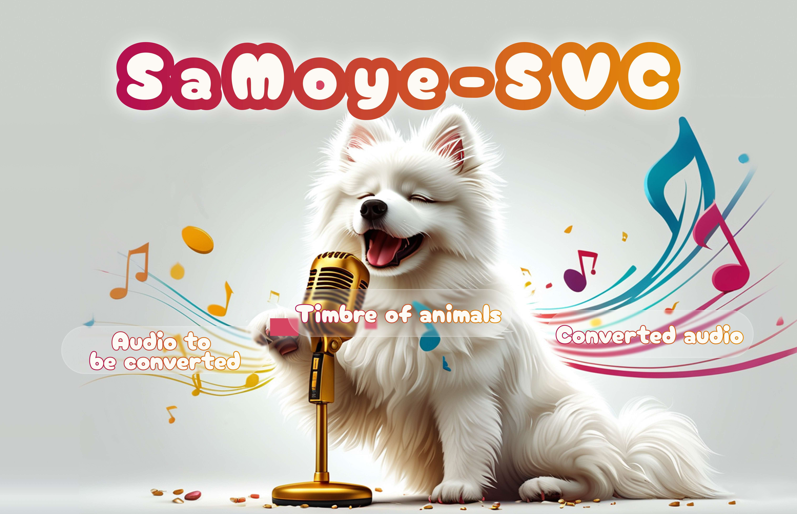

# SaMoye-SVC

```
Even dogs can sing a song.

In the root directory, we have included some audio samples as demos. These samples are outputs from the samoye-svc model, which uses the vocal timbres of cats and dogs to simulate singing. The current results are trained on a dataset of 1700 hours of clean, unprocessed vocal singing data. Feel free to listen and see if you get the sense that these animals have come to life with the ability to sing like humans. For those seeking improved outcomes, you are encouraged to contribute additional clean vocal singing recordings for continued training and scaling up of the model.
```


